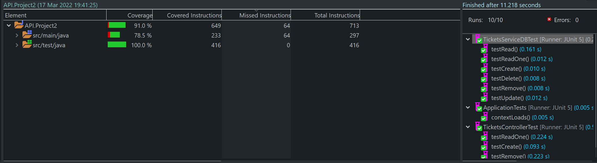

# Cinema Ticket API

## Overview

A CRUD REST API for managing cinema tickets, built as a foundational backend project to demonstrate knowledge of Java, Spring Boot, and database integration with a relational database.

## Tech Stack

* Java 11
* Spring Boot 2.6.4
* MySQL

## Key Features

* Create and modify ticket information in the database
* Unit and integration tests for API endpoints

## How to Run

1. Ensure Java 11 and MySQL are installed.
2. Run the application:`./mvnw spring-boot:run`

## References
#### Update Ticket Data

#### Test Coverage
