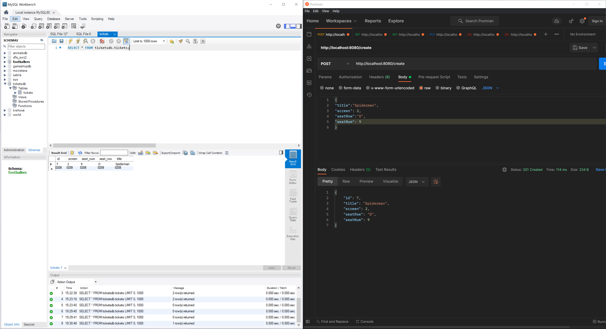
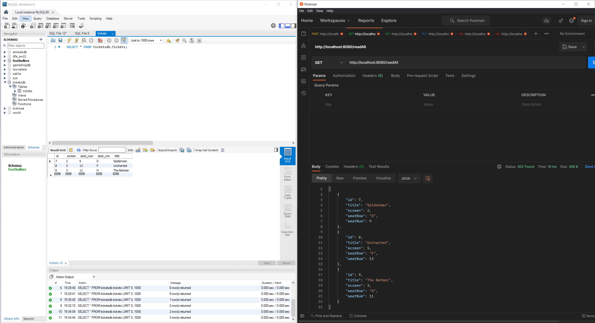
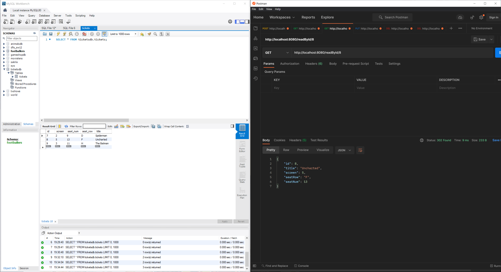
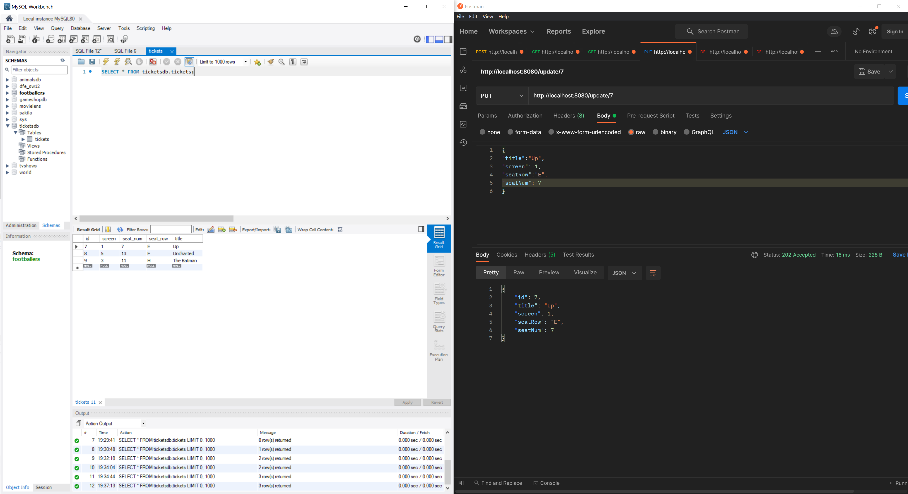
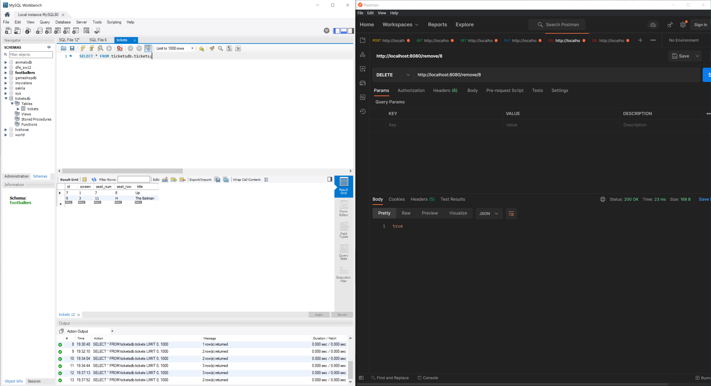
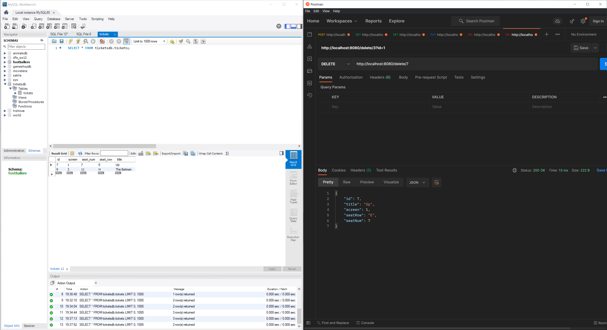
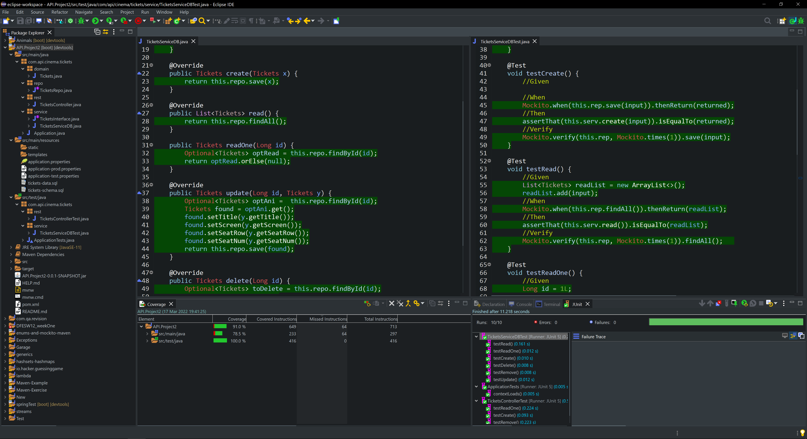

# Cinema Ticket API

## Overview

This was an early backend project completed as part of a guided practical during my initial learning of Java, REST APIs, and database integration.

The goal was to understand how to build a simple CRUD API, connect it to a database, and test endpoints using tools like Postman.

## Explanation
I have created an API that allows you to create, store, view, modify and delete a cinema ticket in a database. I have created this API project to showcase my knowledge of Java, Spring, databases and the interactions between them. 

From the beginning, I knew that this would be a challenging task to undertake. However, with the support of my QA teacher and fellow students, I managed to create this functional API.

During this project, I was able to understand the way databases and the backend interacted together which felt like a massive success. The only part I was struggling with a bit was the testing phase. Fortunately, I was guided in the right way and was able to get everything working.

## Potential improvements
For the second iteration of this project, I would want to add a front end. The front-end would allow regular people to perform the program which would allow the API to be much more available to a wider audience.

A link to the corresponding Jira board https://zsigmond.atlassian.net/jira/software/projects/AP/boards/2/backlog

## References
Pictures of the functionality of the API:

### Create

### Read all

### Read one

### Update

### Delete

### Remove

### Test Coverage 

